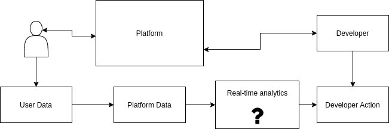
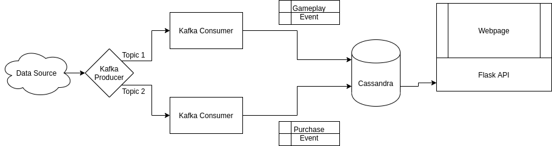
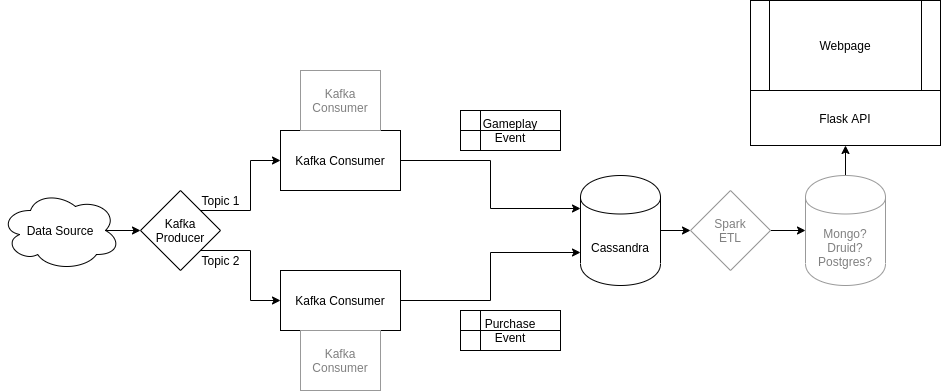

# GameStream
Streaming user engagement metrics using Kafka and Cassandra

## About
Gamestream is inspired by my interests in the games industry. Here we have thousands of independent developers releasing content on games distribution platforms every day, every hour. With interactive media, there is a lot of noise to signal and it can be very difficult to find a market fit, engage with users, and release content in a meaningful way.

Here I propose a solution.

# Motivation

My motivation behind this is the unidirectional relationship with developers to games consumers. The consumers and the media platform often have disproportionate optics into the lifecycle of a game. Consumers glean this through crowd sourcing their interests, using a network effect to share information that is necessarily valuable to consumers, but perhaps not to producers.

Distribution platforms have similar statistics about user metrics, demographics, wishlists and more. Without a platform of their own (AAA publishers), or the necessary resources to build an insight library embedded in their game, they can be left wandering blind.

# Approach

Here we have a solution: a real-time analytics stream that targets games across platforms to reveal invaluable correlations between play times, purchase times, and user age brackets.

# Architecture

The architecture leverages two Kafka consumers with one broker each, consuming two different event types. The consumers then publish them to a Cassandra database.

# Next Steps

